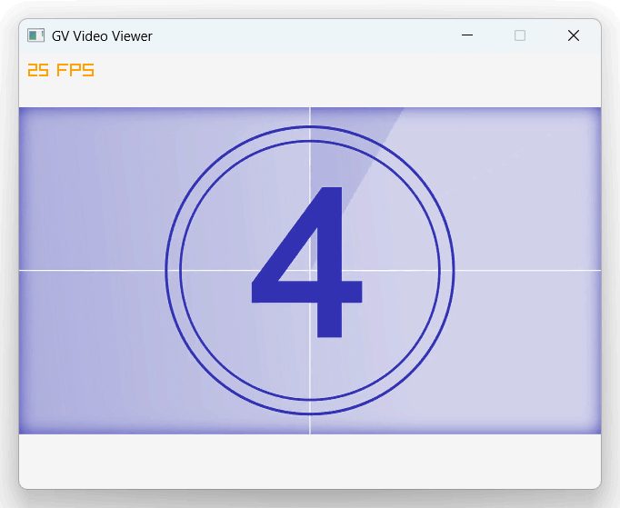

# odin-gv

GV Video ([Extreme Gpu Friendly Video Format](https://github.com/Ushio/ofxExtremeGpuVideo)) decoder for Odin language.

Forked from [v_gvvideo](https://github.com/funatsufumiya/v_gvvideo).



## About

This module provides **only decoder, not player** [^1].<br>
(Player implementations should be separated for each graphic frameworks.)

If you need encoder, please check [Original README of GV video](https://github.com/Ushio/ofxExtremeGpuVideo) and [my fork](https://github.com/funatsufumiya/ofxExtremeGpuVideo).

## Dependencies

- [funatsufumiya/odin-lz4](https://github.com/funatsufumiya/odin-lz4) (included as a git submodule)
- [funatsufumiya/odin-dxt_decoder](https://github.com/funatsufumiya/odin-dxt_decoder) (included as a git submodule)

## Test

```bash
$ odin test tests
```

## Demo on Raylib

```bash
$ odin run demo_raylib
```
code: [demo_raylib/main.odin](./demo_raylib/main.odin)

## Usage notes

- Please use `read_frame_compressed` instead of `read_frame` if your graphics framework supports GPU compressed texture uploading.
  - CPU DXT decoding of `read_frame` is just for test case or compatibility. Very slow.

[^1]: If you need player demo, please check `odin run demo_raylib`
